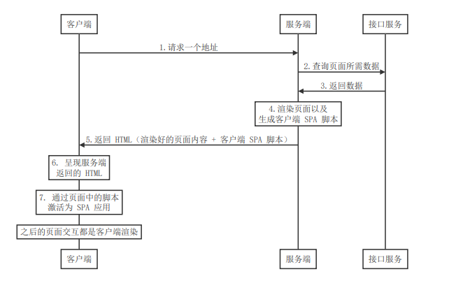

# 服务端渲染(SSR)

## 客户端渲染和传统服务端渲染的问题

- SPA应用有两个非常明显的问题：
  - 首屏渲染慢
  - 不利于 SEO

- 传统的服务端渲染又存在:
  - 应用的前后端部分完全耦合在一起，在前后端协同开发方面会有非常大的阻力；
  - 前端没有足够的发挥空间，无法充分利用现在前端生态下的一些更优秀的方案；
  - 由于内容都是在服务端动态生成的，所以服务端的压力较大；
  - 相比目前流行的 SPA 应用来说，用户体验一般；

## 现代化的服务端渲染(同构)

1. 客户端发起请求
2. 服务端渲染首屏内容 + 生成客户端 SPA 相关资源
3. 服务端将生成的首屏资源发送给客户端
4. 客户端直接展示服务端渲染好的首屏内容
5. 首屏中的 SPA 相关资源执行之后会激活客户端 Vue
6. 之后客户端所有的交互都由客户端 SPA 处理




- 这种方式简而言之就是：
  - 通过服务端渲染首屏直出，解决首屏渲染慢以及不利于 SEO 问题
  - 通过客户端渲染接管页面内容交互得到更好的用户体验

- 但是凡事都不会事完美的,如果要使用服务端渲染,就一定会存在相对的问题
  - 开发条件所限。浏览器特定的代码，只能在某些生命周期钩子函数 (lifecycle hook) 中使用；一些
    外部扩展库 (external library) 可能需要特殊处理，才能在服务器渲染应用程序中运行。
  - 涉及构建设置和部署的更多要求。与可以部署在任何静态文件服务器上的完全静态单页面应用程序
    (SPA) 不同，服务器渲染应用程序，需要处于 Node.js server 运行环境。
  - 更多的服务器端负载。在 Node.js 中渲染完整的应用程序，显然会比仅仅提供静态文件的 server
    更加大量占用 CPU 资源 (CPU-intensive - CPU 密集)，因此如果你预料在高流量环境 (high traffic)
    下使用，请准备相应的服务器负载，并明智地采用缓存策略。

## 什么情况下使用SSR?

其实根据上面的介绍,我们可以总结出两点

1. 首屏渲染速度是否真的重要?
2. **是否真的需要SEO?**

第二点也是最直接判断是否需要使用SSR的条件了,如果你的项目一定需要SEO,那么你也不用纠结,那一定是需要SSR的,反之你才可以酌情考虑

## Nuxt.js的基础介绍及用法

### 什么是Nuxt.js

- 一个基于Vue.js生态的第三方开源服务端渲染应用框架
- 它可以帮我们轻松的使用Vue.js技术栈构建同构应用
- [Nuxt.js](https://zh.nuxtjs.org/guide)

### 使用Nuxt.js的情况

- 初始项目
- 已有的Node.js服务端项目
  - 直接把Nuxt当作一个中间件集成到Node Web Server中
- 现有的Vue.js项目
  - 非常熟悉Nuxt.js
  - 至少百分之10的代码改动

### 初始化Nuxt.js应用的方式

1. 手动创建
2. 使用create-nuxt-app

下面介绍以下手动创建的方式

1. 省略创建文件夹初始化过程...
2. 新建 package.json 文件来设定如何运行 nuxt

```javascript
{
  "name": "my-app",
  "scripts": {
    "dev": "nuxt"
  }
}
```

3. 安装nuxt

```javascript
$ npm i nuxt -D
```

4. 创建pages目录
   - **Nuxt.js 会依据 pages 目录中的所有 *.vue 文件生成应用的路由配置。**

```javascript
$ mkdir pages
```

5. 创建pages/index.vue页面

```Vue
<template>
  <div>
      <h1>Hello Nuxt.js</h1>
  </div>
</template>

<script>
export default {
    name: 'HomePage'
}
</script>

<style>

</style>
```

6. 最后启动项目
```javascript
$ npm run dev
```
- Nuxt.js 会监听 pages 目录中的文件更改，因此在添加新页面时无需重新启动应用程序。

### Nuxt.js路由

- Nuxt.js依据pages目录解构自动生成vue-router模块的路由配置

#### 路由导航

三种方式介绍

- a标签
  - 会刷新整个页面，不要使用

- nuxt-link组件
  - 和router-link是一样的用法

- 编程式导航
  - 和Vue中的编程式导航用法是一样的

那么我们主要来复习一下router-link和编程式导航的用法

```Vue
<template>
  <div>
      <h1>About page</h1>
      <!-- router-link 导航链接组件 -->
      <h2>导航链接组件</h2>
      <router-link to="/">首页</router-link>
      <!-- 编程式导航 -->
      <h2>编程式导航</h2>
      <button @click="onClick">首页</button>
  </div>
</template>

<script>
export default {
    name: 'About',
    methods: {
        onClick() {
            this.$router.push('/')
        }
    }
}
</script>
```

#### 动态路由

- 在Nuxt.js里面定义带参数的动态路由,需要创建对应的**以下划线作为前缀**的Vue文件或目录

以下目录结构:
```
pages/
--| _slug/
-----| comments.vue
-----| index.vue
--| users/
-----| _id.vue
--| index.vue
```

Nuxt.js自动生成对应的路由配置表:

```javascript
router: {
  routes: [
    {
      name: 'index',
      path: '/',
      component: 'pages/index.vue'
    },
    {
      name: 'users-id',
      path: '/users/:id?',
      component: 'pages/users/_id.vue'
    },
    {
      name: 'slug',
      path: '/:slug',
      component: 'pages/_slug/index.vue'
    },
    {
      name: 'slug-comments',
      path: '/:slug/comments',
      component: 'pages/_slug/comments.vue'
    }
  ]
}
```

- 其中users-id 的路由路径带有 :id? 参数，表示该路由是可选的。如果你想将它设置为必选的路由，需要在 users/_id 目录内创建一个 index.vue 文件。

#### 嵌套路由

- 创建内嵌子路由，你需要添加一个 Vue 文件，同时添加一个与该文件同名的目录用来存放子视图组件。
- 父组件(.vue文件) 内需要增加 `<nuxt-child/>` 用于显示子视图内容。

文件结构:
```
pages/
--| users/
-----| _id.vue
-----| index.vue
--| users.vue
```
Nuxt.js 自动生成的路由配置如下：
```javascript
router: {
  routes: [
    {
      path: '/users',
      component: 'pages/users.vue',
      children: [
        {
          path: '',
          component: 'pages/users/index.vue',
          name: 'users'
        },
        {
          path: ':id',
          component: 'pages/users/_id.vue',
          name: 'users-id'
        }
      ]
    }
  ]
}
```

#### 自定义路由配置

需要在`nuxt.config.js`文件中进行配置

```javascript
module.exports = {
    router: {
        // 默认值是 /, 如果修改了base的值则默认会以修改的值开头,注意结尾处必须跟/
        base: '/abc/',  // http://localhost:3000/abc/ 

        // 自定义路由表
        // routes: 数组,路由配置表
        // resolve: 解析路由组件路径
        extendRoutes(routes, resolve) {
            routes.push({
                name: 'Hello',
                path: '/hello',
                component: resolve(__dirname, 'pages/about.vue')
            })
        }
    }
}
```
[更多路由配置](https://zh.nuxtjs.org/api/configuration-router)

#### 中间件

- 中间件允许您定义一个自定义函数运行在一个页面或一组页面渲染之前
- 每一个中间件应放置在 `middleware/` 目录。文件名的名称将成为中间件名称 (`middleware/auth.js`将成为 auth 中间件)。
- 一个中间件接收 `context` 作为第一个参数：

```javascript
export default function (context) {
    // process.server也是nuxt中特有的属性,标识当前是服务端
    context.userAgent = process.server
        ? context.req.headers['user-agent']
        : navigator.userAgent
}
```

中间件执行流程顺序：
1. nuxt.config.js
2. 匹配布局
3. 匹配页面

- 在`nuxt.config.js`中使用中间件会成为全局的,所有的路由改变时都会调用

``` javascript
module.exports = {
  router: {
    middleware: 'auth'
  }
}
```
- 在指定的布局或者页面中使用则不会全局生效

```Vue
<script>
export default {
  middleware: 'auth'
}
</script>
```


### 视图

- 包括应用模板、页面、布局和 HTML 头部等内容。

#### 模板

- 只需要在 src 文件夹下（默认是应用根目录）创建一个 app.html 的文件。

默认模板是:

```html
<!DOCTYPE html>
<html {{ HTML_ATTRS }}>
  <head {{ HEAD_ATTRS }}>
    {{ HEAD }}
  </head>
  <body {{ BODY_ATTRS }}>
    {{ APP }}
  </body>
</html>
```

- 渲染的内容会注入到{{ APP }}中

添加自定义内容:
```html
<!DOCTYPE html>
<html {{ HTML_ATTRS }}>
  <head {{ HEAD_ATTRS }}>
    {{ HEAD }}
  </head>
  <body {{ BODY_ATTRS }}>
    <h1>app.html</h1>
    {{ APP }}
  </body>
</html>
```

#### 布局

Nuxt.js 允许你扩展默认的布局，或在 `layout` 目录下创建自定义的布局。
相当于一个简便的嵌套路由

- 默认布局
  - 可通过添加 `layouts/default.vue` 文件来扩展应用的默认布局。
  - **只要有`default.vue`这个文件就会默认成为所有组件的布局组件,通过自定义布局来改变样式**
  - 如果只有个别文件需要布局,则创建指定布局文件即可,不要创建`default.vue`文件

默认布局: <nuxt/> 组件用于显示页面的主体内容。
```vue
<template>
  <nuxt />
</template>
```

修改后的默认布局为:

```vue
<template>
  <div>
      <h1>layouts/default.vue 组件</h1>
      <!-- 页面出口,类似于子路由出口 -->
      <nuxt/>
  </div>
</template>

<script>
export default {
    name: 'LayoutDefault'
}
</script>

<style>

</style>
```

- 自定义布局

以下为`layouts/foo.vue`文件的内容(写法和默认的一样)
```vue
<template>
  <div>
      <h1> layouts/foo.vue 组件</h1>
      <nuxt/>
  </div>
</template>

<script>
export default {
    name: 'LayoutFoo'
}
</script>

<style>

</style>
```

在需要改变默认布局的组件中引入,通过layout参数改变布局组件

```vue
<template>
  <div>
      <h1>About page</h1>
  </div>
</template>

<script>
export default {
    name: 'AboutPage',
    // 通过layout参数改变布局组件, 该参数默认值为default
    layout: 'foo'
}
</script>
```

### asyncData 异步数据

- 基本用法
  - 它会将asyncData 返回的数据融合组件data方法返回数据一并给组件
  - 调用时机: **服务端渲染期间和客户端路由更新之前**
- **注意事项**
  - 只能在页面组件中使用(子组件中无法使用)
  - 没有this, 因为asyncData是在组件初始化之前被调用的

上代码

```vue
<template>
    <div>
        <h1>Hello Nuxt.js</h1>
        <h2>{{ title }}</h2>
        <h2>{{ foo }}</h2>
        <ul>
            <li v-for="item in posts" :key="item.ide">{{item.title}}</li>
        </ul>
    </div>
</template>

<script>
import axios from "axios";
export default {
    name: "HomePage",
    // 动态页面内容有利于SEO或者是提升首屏渲染速度时候,就在asyncData中发请求拿数据
    async asyncData() {
        const { data } = await axios.get("http://localhost:3000/data.json");
        return { posts: data.posts, title: data.title };
    },
    data() {
        return {
            foo: 'Foo'
        }
    }
};
</script>

<style>
</style>
```

#### 上下文对象

[context对象内的变量](https://zh.nuxtjs.org/api/context)
```vue
<script>
export default {
    // 上下文对象是asyncData的参数
    async asyncData(context) {
    }
}
</script>
```

简单使用上下文的一段代码,通过动态路由传参渲染对应的值

```vue
<template>
    <div>
        <h1>article page</h1>
        <h2>{{ article.title }}</h2>
        <p>{{ article.body }}</p>
    </div>
</template>

<script>
import axios from "axios";
export default {
    name: "ArticlePage",
    async asyncData(context) {
        // 解构出data中的title和posts属性
        const { data: { title, posts } } = await axios.get("http://localhost:3000/data.json");
        const id = parseInt(context.params.id)
        // 找到posts中id和动态路由中传递的id相同的article对象
        const article = posts.find(item => {
            return item.id === id
        })
        // 最后必须返回一个,对象内是要渲染的属性
        return {
            article
        }
    },
};
</script>
```
#### watchQuery

- 默认情况下query的改变不会调用asyncData方法, 使用watchQuery监听query的变化调用asyncData
- 使用watchQuery属性监听参数字符串如果更改将调用所有组件方法(asyncData, fetch, validate, layout, ...)。 
- watchQuery可以设置为`Boolean`或`Array`如果设置为true, 将对所有参数字符串设置监听 
```vue
<script>
export default {
    // 监听query参数page变化时当前组件触发asyncData
    watchQuery: ['page']
}
</script>
```